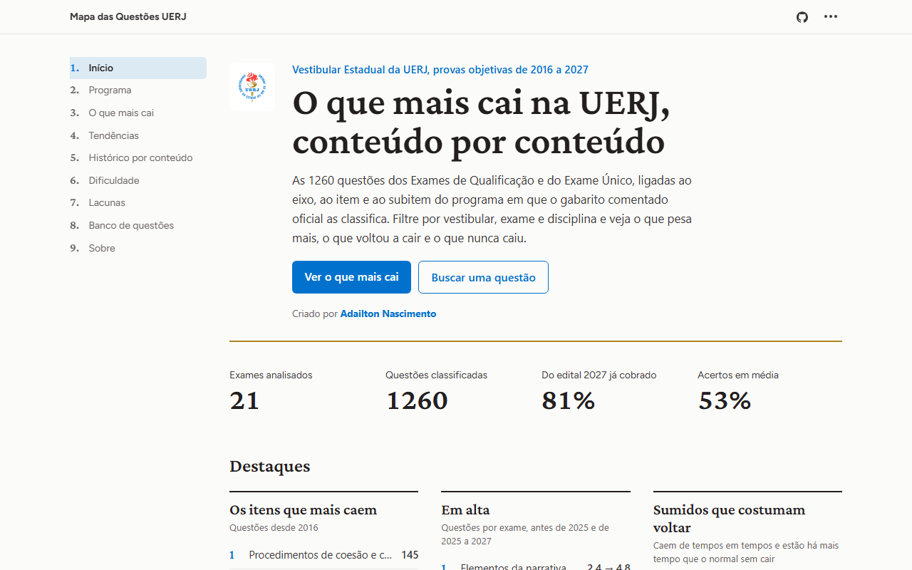
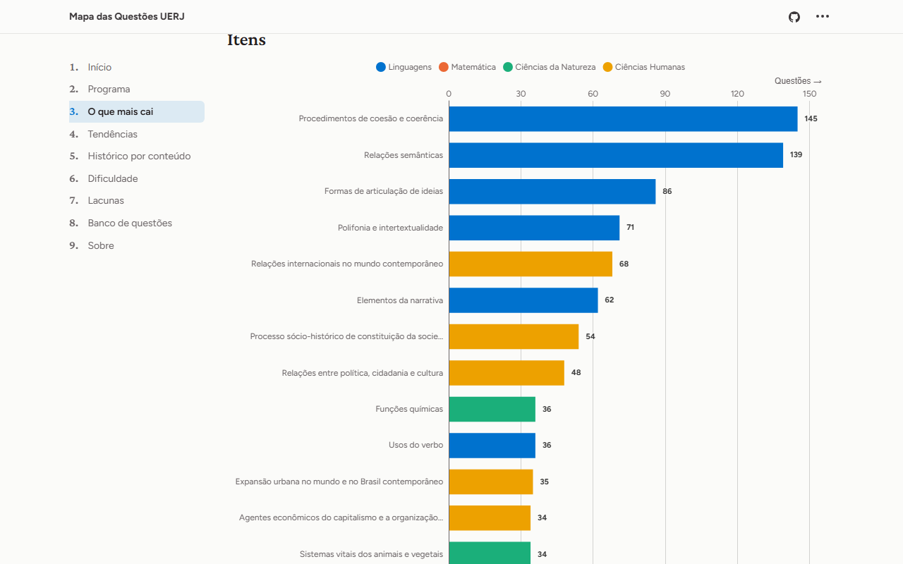
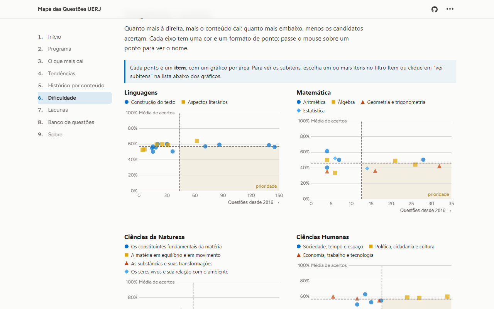
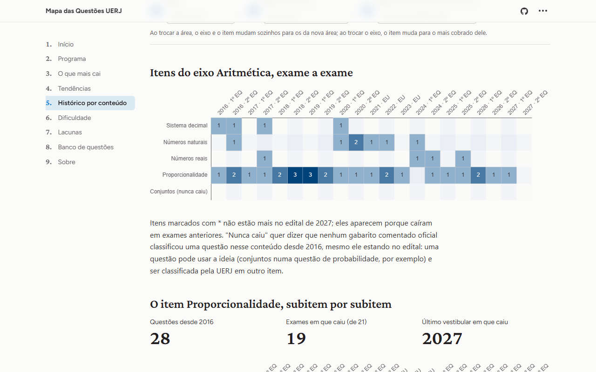
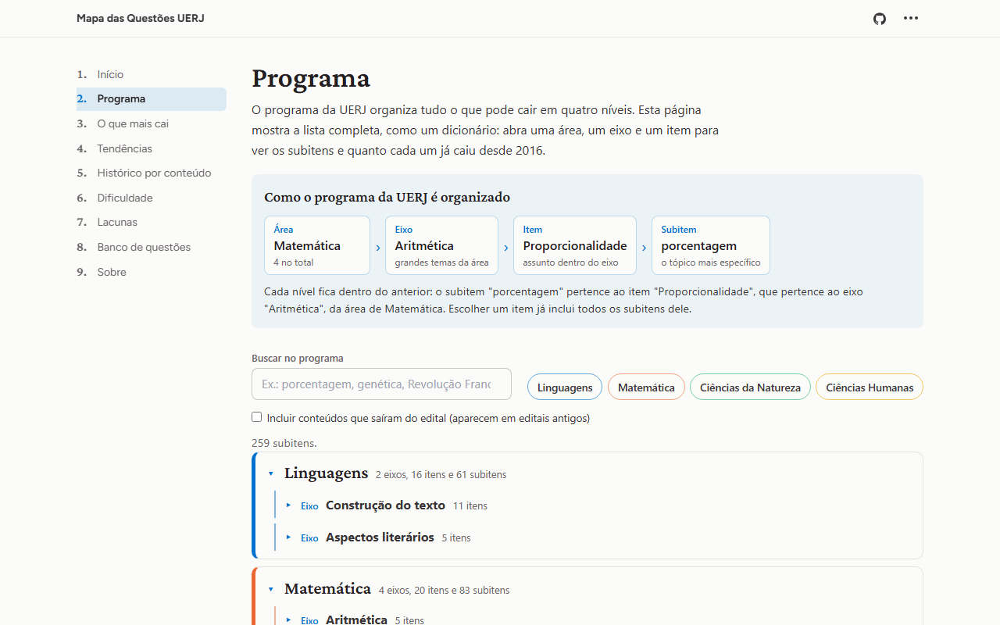
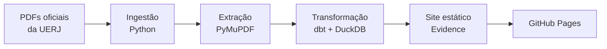

<div align="center">

# Mapa das Questões UERJ

O que caiu nas provas objetivas do Vestibular Estadual da UERJ, de 2016 a 2027, conteúdo por conteúdo.

### [Acessar o site](https://jnsadailton.github.io/mapeamento-questoes-uerj/)

[](https://github.com/jnsadailton/mapeamento-questoes-uerj/actions/workflows/site.yml)


</div>



## O que é

Um site público e gratuito para quem estuda para a UERJ. Ele reúne as **1.260 questões** dos 21 exames de 2016 a 2027
e mostra em que conteúdo do programa cada uma caiu, segundo o gabarito comentado oficial da universidade.

## O que dá para fazer

- **Ver o que mais cai**, filtrando por vestibular, exame, área, disciplina, eixo e item.
- **Acompanhar tendências:** o que cai em quase toda prova, o que está em alta e o que sumiu mas costuma voltar.
- **Achar a prioridade de estudo:** o que cai muito e tem poucos acertos.
- **Consultar o programa inteiro**, com busca e o que já caiu de cada conteúdo.
- **Ver o que nunca caiu** e está no edital.
- **Abrir qualquer questão** no PDF oficial da prova ou do gabarito comentado, direto na página dela.

<table>
  <tr>
    <td></td>
    <td></td>
  </tr>
  <tr>
    <td align="center">O que mais cai</td>
    <td align="center">Dificuldade e prioridade de estudo</td>
  </tr>
  <tr>
    <td></td>
    <td></td>
  </tr>
  <tr>
    <td align="center">Histórico exame a exame</td>
    <td align="center">Programa com busca</td>
  </tr>
</table>

## Como é feito



- **Dados oficiais:** 84 PDFs da UERJ (provas, gabaritos, gabaritos comentados e conteúdos programáticos), cada um
  conferido para garantir que é idêntico ao publicado.
- **Comparável entre os anos:** a redação do programa muda de um edital para outro; uma hierarquia única liga cada
  redação antiga ao conteúdo atual.
- **Testado:** 172 testes na leitura dos PDFs e 58 testes de dados no dbt.
- **Automatizado:** a cada atualização, o GitHub Actions refaz todo o caminho, do PDF ao site publicado.
- **Sem servidor e sem custo:** as consultas rodam no navegador (DuckDB-WASM) e o site fica no GitHub Pages.

Arquitetura, decisões, modelo de dados e testes em detalhe: **[como funciona](docs/como-funciona.md)**.

## Rodar localmente

Requer Python 3.12, [uv](https://docs.astral.sh/uv/) e Node.js 24.

```bash
git clone https://github.com/jnsadailton/mapeamento-questoes-uerj.git
cd mapeamento-questoes-uerj

uv sync
uv run pytest                            # testes
uv run python -m uerj.ingestao           # PDFs em data/raw/ (sem internet: --somente-repositorio)
uv run python -m uerj.extracao           # dados extraídos em data/bronze/

cd dbt && uv run dbt build --profiles-dir . && cd ..   # modelos e testes de dados

cd site && npm ci && npm run sources && npm run build  # site estático em site/build/
```

## Dados e limitações

Fontes: [vestibular.uerj.br](https://www.vestibular.uerj.br/) (provas, gabaritos e editais) e
[revista.vestibular.uerj.br](https://www.revista.vestibular.uerj.br/questao/) (gabaritos comentados). O catálogo de
todos os PDFs, com o endereço de cada um, está em [`fontes/fontes.yml`](fontes/fontes.yml).

- O percentual de acertos existe para 1.248 das 1.482 versões de questão: os gabaritos comentados de 2021, 2024-2 e
  2027-2 não o publicam, e ele falta nas anuladas e em algumas questões de 2020-2 e 2022-1.
- Ligar uma redação antiga ao conteúdo atual exige julgamento em alguns casos; cada decisão está justificada no
  repositório.
- Escopo: 1º e 2º Exames de Qualificação e Exame Único. Ficam de fora o Exame Discursivo e a Redação.

## Autor

Criado por **[Adailton Nascimento](https://www.linkedin.com/in/adailton-araujo-nascimento/)**. O desenvolvimento contou
com o apoio do [Claude Code](https://claude.com/claude-code), assistente de programação da Anthropic.

Projeto independente e gratuito, sem vínculo com a UERJ. A marca da universidade aparece no site só para identificar a
fonte dos dados.
