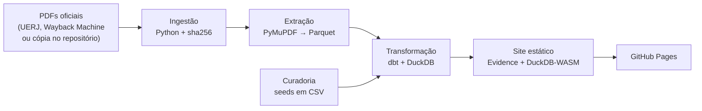

# Como o Mapa das Questões UERJ funciona

Detalhes técnicos do projeto: arquitetura, decisões, modelo de dados e testes. A visão geral está no
[README](../README.md).

## Arquitetura



| Camada | Ferramenta | Papel |
|---|---|---|
| Ambiente | Python 3.12 + [uv](https://docs.astral.sh/uv/) | dependências travadas em `uv.lock` |
| Ingestão | Python | baixa cada PDF da fonte disponível e confere o sha256 |
| Extração | PyMuPDF | lê os PDFs pela posição do texto na página e grava Parquet (camada bronze) |
| Warehouse | DuckDB | um arquivo local, sem servidor |
| Transformação | dbt-core + dbt-duckdb | staging, intermediate e marts, com testes de dados e documentação |
| Curadoria | seeds do dbt (CSV versionado) | a hierarquia de conteúdos e as correções, com justificativa |
| Visualização | [Evidence](https://legacy-docs.evidence.dev/) | páginas em Markdown + SQL; as consultas rodam no navegador |
| CI/CD | GitHub Actions + GitHub Pages | pipeline completo e publicação a cada push na `main` |

## Desafios e decisões

**PDFs difíceis de ler.** Nos gabaritos comentados, a ordem do texto extraído vem embaralhada; cada comentário é ligado
ao rótulo "QUESTÃO NN" pela posição na página. Em 2026 e 2027, a fonte Cambria não tem tabela de caracteres e o texto
sai como números de glifo: um decodificador próprio (`src/uerj/extracao/pdf_texto.py`) traduz os glifos e junta acentos
que vêm soltos. Os gabaritos têm dois layouts, e a prova é lida para achar a página de cada questão, para o site abrir o
PDF direto nela.

**Fontes que somem.** Cada PDF tem URL e sha256 no catálogo [`fontes/fontes.yml`](../fontes/fontes.yml). A ingestão
tenta o site da UERJ, depois o Wayback Machine e por fim a cópia guardada em `fontes/pdfs/`, e só aceita um arquivo
idêntico ao registrado. A origem de cada arquivo vira uma tabela de proveniência, mostrada no site.

**Um programa que muda de redação.** "Sequências" vira "sucessões", subitens mudam de item, itens são renomeados. Para
comparar os anos, todo texto passa por uma **hierarquia canônica** (Área › Eixo › Item › Subitem, com IDs como
`MAT.1.04.02`) e por um dicionário de 807 redações ligadas ao conteúdo atual. As decisões manuais têm justificativa, e o
que o projeto completou ou estimou aparece no site com um adendo público.

**Contar sem distorcer.** No bloco de língua estrangeira, cada idioma é uma versão da questão. Na incidência, a unidade
é o número da questão (o candidato responde um idioma só); na dificuldade, cada versão conta, porque cada uma tem o
próprio percentual de acertos. Uma questão com várias classificações conta para cada conteúdo.

**Disciplina.** Ciências da Natureza é separada em Física, Química e Biologia (pelo item); Linguagens em Língua
Portuguesa, Literatura e Língua Estrangeira. Ciências Humanas fica como área única, porque os editais tratam Geografia
e História de forma integrada.

**Indicadores descritivos.** Regularidade, tendência, intervalo entre cobranças e atraso (`mart_recorrencia`) descrevem
o que já aconteceu; nenhum deles é previsão da próxima prova.

**Site sem servidor.** O Evidence gera um site estático e as consultas SQL rodam no navegador, com DuckDB-WASM. Os
filtros em cascata são um componente próprio ([`site/components/Filtro.svelte`](../site/components/Filtro.svelte)): cada
nível só oferece o que existe dentro do que está marcado acima. O script
[`site/scripts/traduzir-componentes.mjs`](../site/scripts/traduzir-componentes.mjs), que roda depois do `npm ci`, traduz
os textos fixos dos componentes do Evidence e corrige o menu lateral. A paleta foi validada para daltonismo
([`paleta-de-cores.md`](paleta-de-cores.md)), e o site tem modo escuro e layout para celular.

## Modelo de dados

Esquema estrela no DuckDB, construído pelo dbt em três camadas:

```text
bronze (Parquet) ─► staging ─► intermediate ──────────────► marts
seeds de curadoria ───────────┘  curadoria e ligação       dimensões, fatos e marts do site
                                 pelo dicionário
```

| Modelo | Conteúdo |
|---|---|
| `dim_exame` | os 21 exames: ano do vestibular, número, tipo (Qualificação ou Único), data de aplicação e links |
| `dim_conteudo` | a hierarquia canônica: 4 áreas, 13 eixos, 81 itens e 334 subitens |
| `fct_questao` | uma linha por questão e idioma (1.482 versões de 1.260 questões): gabarito, anulada, percentual de acertos, páginas na prova e no comentado |
| `fct_classificacao` | questão × conteúdo (uma questão pode ter várias classificações) |
| `bridge_programa_ano` | em que exames cada subitem consta do edital |
| `mart_incidencia`, `mart_recorrencia`, `mart_dificuldade`, `mart_lacunas` | as tabelas que alimentam o site |

| Seed (curadoria) | Papel |
|---|---|
| `conteudo_base.csv` | a hierarquia, com base no edital de 2027 e os conteúdos antigos marcados como fora do edital |
| `dicionario_conteudo.csv` | cada redação vista num edital ou comentário → conteúdo canônico, com método e justificativa |
| `correcoes.csv` | classificações transcritas da imagem do PDF ou completadas quando o PDF omite eixo, item ou subitem |
| `eixos_atribuidos.csv` | eixo tirado do edital quando o comentário não o informa |

A documentação dos modelos sai com `uv run dbt docs generate --profiles-dir .` (dentro de `dbt/`).

## Testes

- **172 testes em pytest** sobre os parsers e a ingestão, rodando nos 21 exames, com as falhas conhecidas das próprias
  fontes registradas como casos de teste.
- **58 testes de dados no dbt:** 60 questões por exame; gabarito só de A a D ou anulada; anuladas exatamente as
  oficiais; toda questão não anulada classificada; percentual entre 0 e 100 e ausente só onde o PDF não o publica;
  chaves únicas e estrangeiras.
- **Nenhum texto se perde:** uma redação que não casa com o dicionário vai para o modelo `pendencias`, e um teste falha
  enquanto houver pendência. `uv run python -m uerj.curadoria` sugere as ligações para revisão.

## Estrutura do repositório

```text
fontes/            catálogo dos PDFs (fontes.yml) e a cópia guardada de cada um
src/uerj/
  ingestao/        download, conferência do sha256 e proveniência
  extracao/        leitura dos PDFs (gabarito, comentado, conteúdo programático, prova)
  curadoria/       normalização de texto e sugestões para o dicionário
dbt/               modelos (staging, intermediate, marts), seeds de curadoria e testes
site/              páginas, componentes e fontes de dados do Evidence
tests/             pytest
docs/              esta documentação, a paleta de cores e as imagens do README
.github/workflows/ pipeline e publicação
```
